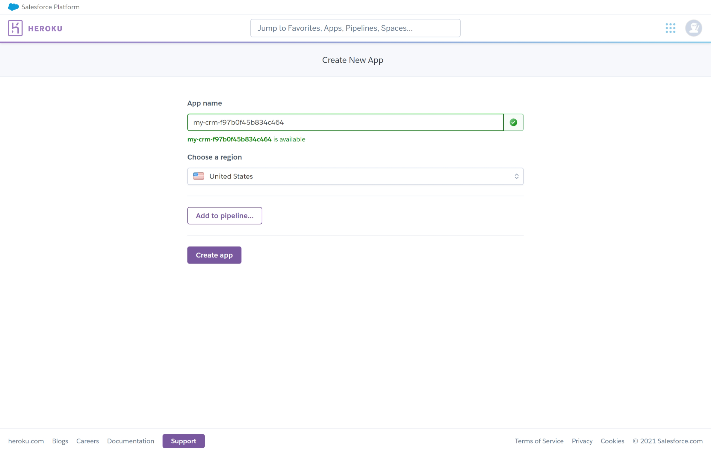
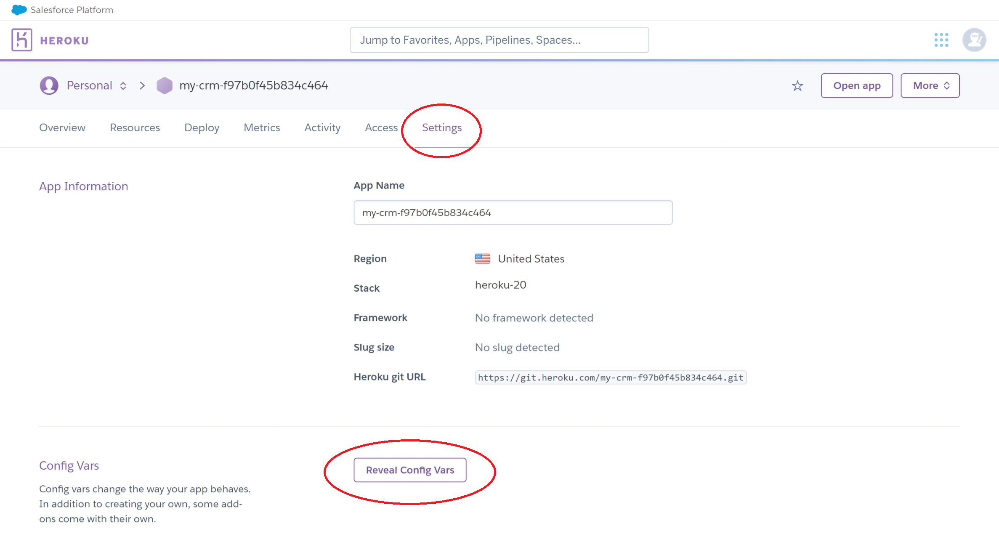
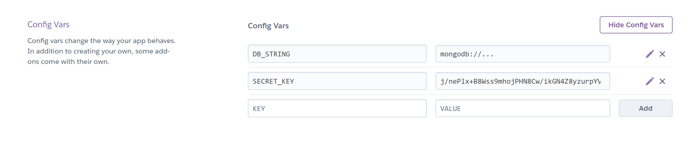
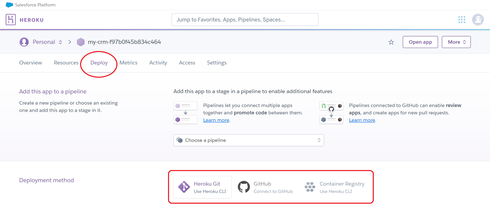

# Source code
This subdirectory holds the source code for our CRM.

Our product can be deployed either to [Heroku](#deploy-to-heroku) or [any other host](#building).

## Deploy to Heroku
1. Log into Heroku and create an app for the deployment.

1. Navigate to the settings page to add Config Vars.

1. The following Config Vars are required:

|Key|Value meaning|
|-|-|
|`DB_STRING`|The MongoDB connection string to your database.|
|`SECRET_KEY`|Our server uses AES-256 to encrypt user session tokens, so it requires a 32-byte secret key to function. The server process expects the key to be encoded in Base64. You can easily generate a key by running `crypto.randomBytes(32).toString('base64')` in Node.js.|


4. Finally clone our source code repository and choose a deployment method most appropriate for you to push to Heroku. The existing Procfile will automatically use the Config Vars added earlier to configure the server.


## Building
- Clone the repository
  ```
  git clone https://github.com/chomosuke/IT-PROJECT-PorkBellyPro.git
  cd IT-PROJECT-PorkBellyPro
  ```
- Install dependencies
  ```
  npm install
  ```
- Build monorepo
  ```
  npm run build
  ```

## Running
First choose a secret key to be used with encryption on the server.
The server uses the AES256 encryption algorithm so the key must be 32 bytes long.
Use the `-s` or `--secret` command line argument to provide the key in **base64** encoding.

One easy way to obtain a secret key is using Node's own crypto API to generate one:
```
crypto.randomBytes(32).toString('base64');
```

- With default port 80
  ```
  npm start -- -s <secret> -c mongodb://...
  ```
- With a specific port
  ```
  npm start -- -s <secret> -c mongodb://... -p <port>
  ```

## Contributing
This codebase has a linter set up to automatically run upon Git commit.
If your code fails to commit and you see a line like
```
npm ERR! Lifecycle script `lint:nofix` failed with error: 
```
in your console, this means the linter spotted code style errors.
Fix them before committing your changes.
Small errors may be automatically fixable with
```
npm run lint
```
so try that first.
